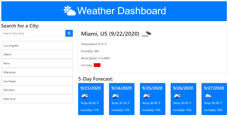

# Weather Dashboard  
___
## Objective
Build a weather dashboard using weather data from [OpenWeather API](https://openweathermap.org/api) to view current and future weather for a city.  The user will be able to input a city and view its relative weather data.  The city name, date, and weather icon representing the weather on the current date will appear.  The temperature, humidity, wind speed, and UV index will also appear below the city name and date.  The UV index will be color coded to identify the severity: favorable(green), moderate(yellow), or severe(orange-red-violet). The future weather will be displayed as a 5-day forecast displaying the date; a weather icon representing the weather on that date; the temperature, and the humidity.  The user will be able to click on a city stored in the search history, and again view its current and future weather.  When re-opening the app, it will display the current and future weather for the last city that was searched.  If there were no cities searched, it will display the weather for New York, New York.

___
## Layout: index.html
The HTML file was built using primarily Bootstrap components. A **jumbotron** was used in the `header` of the code to provide a name for the app. A **cloud-sun** icon from font awesome (https://fontawesome.com/icons/cloud-sun?style=solid) was inserted for added appearance.  The `main` element for the schedule was built using the Bootstrap grid system.  It consists of 1 row, and two columns: **col-md-4**, and**col-md-8**.
- the first column is used to display the **Search for a City** form input field.  Below this field is a div with **class="citiesSearch btn-group-vertical"** to represent a group of vertical Bootstrap buttons used to store the city names input by the user.
- the second column is used to display the current city, date, and weather icon in the **id="presentWeather"** div element.  Additional weather data is dynamically displayed below this element.  The 5 Day forecast is dynamically appended to the div **id="futureForecast"** using dynamically created Bootstrap cards.

___
## Layout: style.css
The CSS file utilized styling that gave the HTML elements a desirable appearance as the app is re-sized or for multiple screen sizes.  Color selection for the jumbotron, the city search button, and Bootstrap cards were given the same shade of blue.  Text was white if on a blue background, and black if on a white background. 

___
## Layout: script.js
The JavaScript code used primarily 5 functions. The app is initiated by retrieving the city search array from local storage and displaying the weather for the last element in the array.  If the array is empty, the weather for New York is displayed.  The **presentWeather(city)** function sends a queryURL1 request to **openweathermap.org** and runs the returned response inside the **.then function()**.  The response object of data is then evaluated to display the city, date (using the **dt** time data), and current weather information in imperial units.  The **futureWeather(city)** function sends a queryURL3 request to **openweathermap.org** and runs the returned response inside the **.then function()**.  The response object of data is evaluated to display the future weather information using the **dt** time data to determine the five forecast dates.  The .each function is used to iterate through the forecast days and display the daily forecast data to each dynamic Bootstrap card.  The **presentUV(coordinates)** function sends a queryURL2 request containing the latitude and longitude coordinates for the city to **openweathermap.org** and runs the returned response inside the **.then function()**.  The response object of data is evaluated to display the present UV index information based on the **response.value** number.  The value determines the appropriate UV Index color from the else if statement.  The index value and color is appended to the **presDiv** element.  The **cityBtn(city)** function adds a city to the search history if it is not there and stores the name to local storage using JSON stringify.  The **recordCitySearch(array)** function is used to display the existing array of searched cities on the vertical group of Bootstrap buttons. 

___
## Summary
 Weather information is arguably one of the more important daily news events for many people across the world.  There are countless methods one can utilize to view the weather, and the introduction of electronic devices has made it easier to receive the data.  This assignment was very challenging to me, and I found myself searching various resources to complete it on time.  In particular, I tried several ways to display the weather data such as icon images and the UV index color using different JSON syntax.  In hindsight, I would have pseudo coded this more, and planned on creating the five Bootstrap cards in the index.html code instead of dynamically creating them.      

## Application Links and Images  
**Links:**  
Application link: (https://ed-sivick.github.io/6-weather_dashboard/)  
index.html code: (https://github.com/ed-sivick/6-weather_dashboard/blob/master/index.html)  
JavaScript.js code: (https://github.com/ed-sivick/6-weather_dashboard/blob/master/assets/script.js)  
style.css code: (https://github.com/ed-sivick/6-weather_dashboard/blob/master/assets/style.css)

  